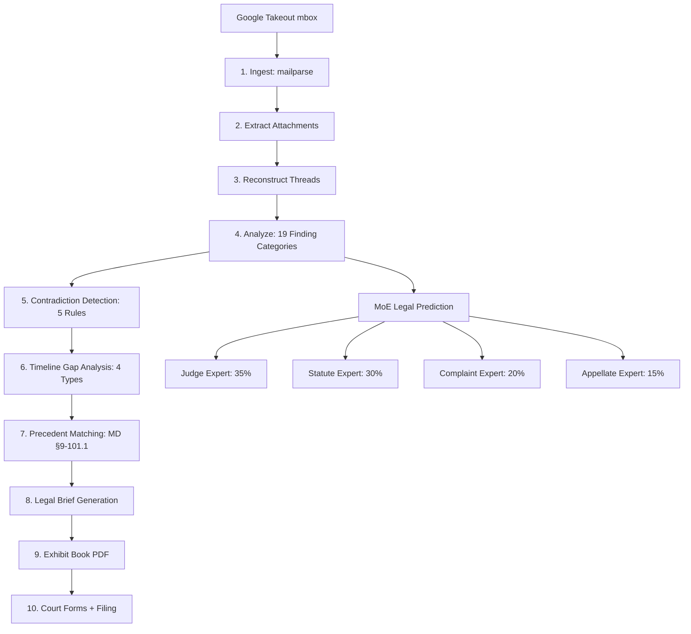

<!-- Unlicense — cochranblock.org -->

# Proof of Artifacts

*Concrete evidence that this project works, ships, and is real.*

> Google Takeout emails → court-ready exhibit books, legal briefs, and filled forms in one evening.

## Architecture



## Build Output

| Metric | Value |
|--------|-------|
| Lines of Rust | 5,481 |
| Pipeline stages | 10 (ingest → forms) |
| Finding categories | 19 (IEP violation, alienation, food record, behavioral incident, etc.) |
| Contradiction types | 5 (school vs. parent, food refusal, attendance, custody week, behavioral) |
| Gap types | 4 (missing reports, communication silence, custody week gaps, thread abandonment) |
| Precedent cases | 17 validated Maryland citations |
| Best interest factors | 12 (MD §9-101.1 mapping) |
| MoE experts | 4 (Judge, Statute, Complaint, Appellate) with gating network |
| Sample case output | 500+ findings, 100+ contradictions, 50+ gaps → court-ready filing |

## Key Artifacts

| Artifact | Description |
|----------|-------------|
| 10-Stage Pipeline | Raw mbox → exhibit book in one command. No manual exhibit numbering |
| Finding Extraction | 19 custody-relevant categories with custody-week assignment (plaintiff vs. defendant) |
| Contradiction Engine | Cross-references school reports against parent claims — surfaces documentary lies |
| Timeline Gap Analysis | Detects missing daily reports, communication silences, thread abandonment |
| Precedent Matching | 17 Maryland cases mapped to findings → automatic brief with case law + exhibit cross-refs |
| MoE Legal Prediction | 4-expert architecture with gating network + challenge layer (flags weaknesses) |
| Citation Verifier | 20 known MD cases checked — flags bad format, missing, or unverified citations |
| Filing Generator | Motion to Modify Custody + Memorandum in Support with exhibit/citation cross-refs |
| Exhibit Book PDF | Cover, TOC, numbered exhibits, contradiction summaries, gap analysis — court-formatted |
| Court Form Generation | Filled MD CC-DR-007, Motion to Modify Custody, Memorandum in Support |

## How to Verify

```bash
cargo build --release -p illbethejudgeofthat
cargo run --release -- \
  --input path/to/takeout.mbox \
  --plaintiff "Name" --defendant "Name" \
  --children "Child1" --dobs "01/15/2018" \
  --state MD --county "Anne Arundel"
ls filing/   # findings.json, contradictions.json, gaps.json, PLAINTIFF_EXHIBIT_BOOK.pdf, MOTION_MODIFY_CUSTODY.pdf
```

---

*Part of the [CochranBlock](https://cochranblock.org) zero-cloud architecture. All source under the Unlicense.*
