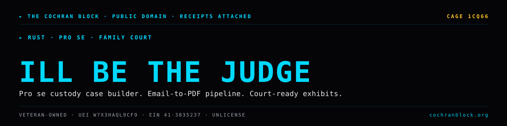

<!-- COCHRANBLOCK-BRAND-HEADER:START - generated by cochranblock/scripts/brand-stamp.sh -->
<picture>
  <source media="(prefers-color-scheme: dark)" srcset="assets/brand/banner.svg">
  <source media="(prefers-color-scheme: light)" srcset="assets/brand/banner.svg">
  
</picture>

[](https://unlicense.org)
[](https://www.rust-lang.org)
[](https://cochranblock.org)
[](https://cochranblock.org)

> &#9656; **RUST** &#183; **PRO SE** &#183; **FAMILY COURT**
<!-- COCHRANBLOCK-BRAND-HEADER:END -->


# illbethejudgeofthat v0.4.1

**Pro se custody case builder. Google Takeout → court-ready exhibit book + filled forms.**

10-stage Rust pipeline that turns an mbox email archive into a numbered PDF exhibit book, Motion to Modify Custody, Memorandum in Support, and four filled Maryland court forms. Status: scaffold — core pipeline compiles, runs, and produces output; legal prediction module is stubbed.

---

## Documentation

This README is the entry point. The actual docs live in two source-of-truth files at the root of the repo:

- **[PROOF_OF_ARTIFACTS.md](PROOF_OF_ARTIFACTS.md)** — what exists today, status, source-linked. Pipeline stages, module status, CLI flags, output artifacts, test coverage, bug history. If you want to know what this project *does*, read this.
- **[TIMELINE_OF_INVENTION.md](TIMELINE_OF_INVENTION.md)** — dated, commit-level record of what was built, when, and why. If you want to know how this project *got built*, read this.

Supporting docs:

- [BACKLOG.md](BACKLOG.md) — prioritized open work
- [ASSUMED_BREACH_THREAT_MODEL.md](ASSUMED_BREACH_THREAT_MODEL.md) — security model
- [docs/compression_map.md](docs/compression_map.md) — P13 tokenization (fN/TN)

---

## Run It

```bash
cargo build --release                                    # 2.5MB stripped binary
cargo test                                               # 86 tests

cargo run --release -- \
  --input path/to/takeout.mbox \
  --plaintiff "Your Name" \
  --defendant "Other Parent" \
  --children "Child1,Child2" \
  --dobs "01/15/2018,03/22/2020" \
  --state MD \
  --county "Anne Arundel"
```

Full usage, CLI flags, and output artifact list in [PROOF_OF_ARTIFACTS.md → Usage](PROOF_OF_ARTIFACTS.md#usage).

---

## License

Unlicense (public domain). See [UNLICENSE](UNLICENSE).

Built by a father who needed it. Part of [The Cochran Block](https://cochranblock.org).
<!-- COCHRANBLOCK-BRAND-FOOTER:START - generated by cochranblock/scripts/brand-stamp.sh -->

---

<sub>&#9656; **THE COCHRAN BLOCK, LLC** &#183; Veteran-Owned &#183; **CAGE** `1CQ66` &#183; **UEI** `W7X3HAQL9CF9` &#183; **EIN** `41-3835237`</sub>

<sub>&#9656; PUBLIC DOMAIN &#183; UNLICENSE &#183; RECEIPTS ATTACHED &#183; [**cochranblock.org**](https://cochranblock.org) &#183; [github.com/cochranblock](https://github.com/cochranblock)</sub>
<!-- COCHRANBLOCK-BRAND-FOOTER:END -->
